# Digital-India
This is a responsive website on the topic Digital India created using HTML, CSS and Bootstrap Framework.
You can see this live here: https://thepranaygupta.github.io/Digital-India/

## Desktop-Screenshots
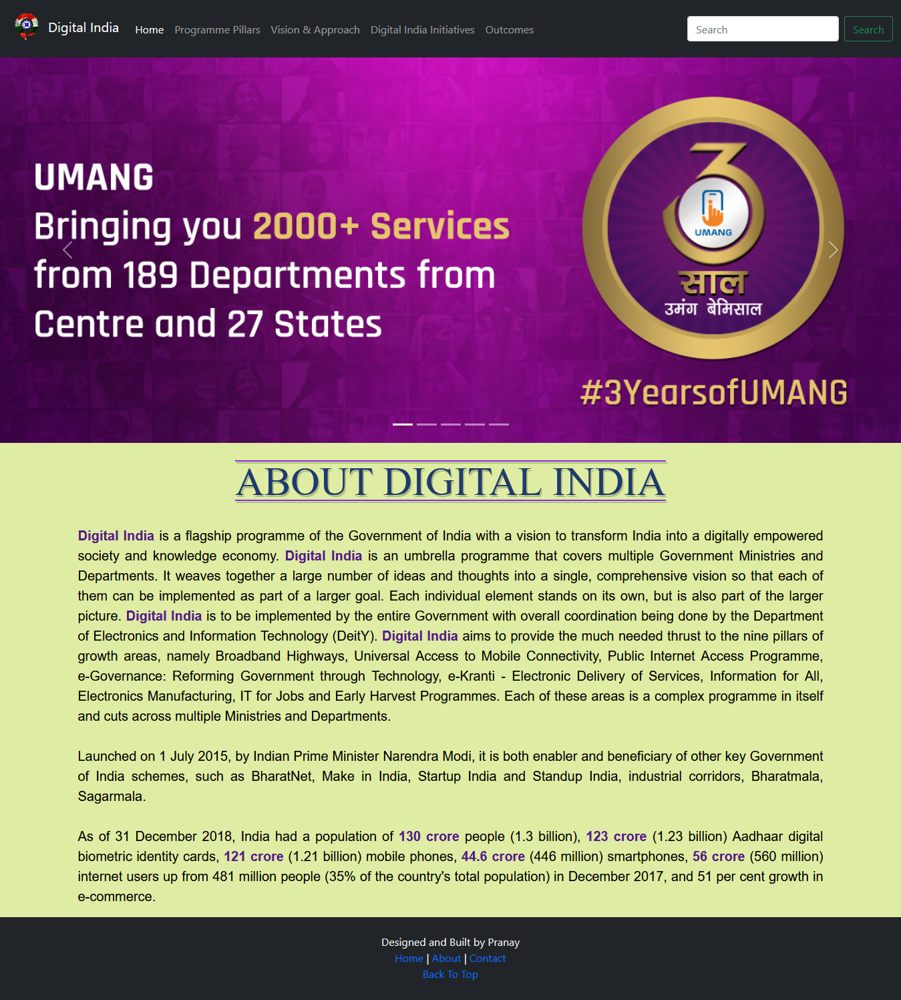
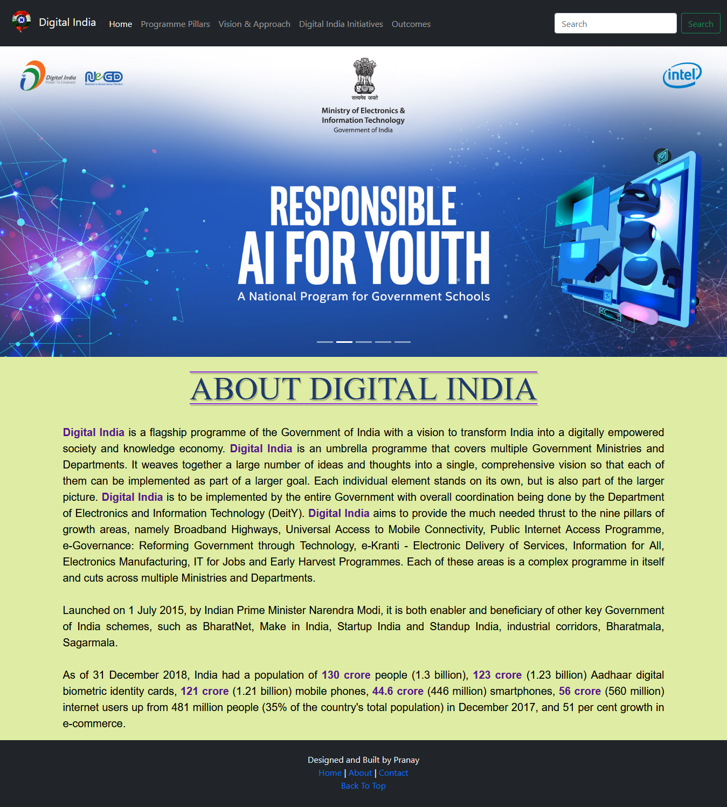
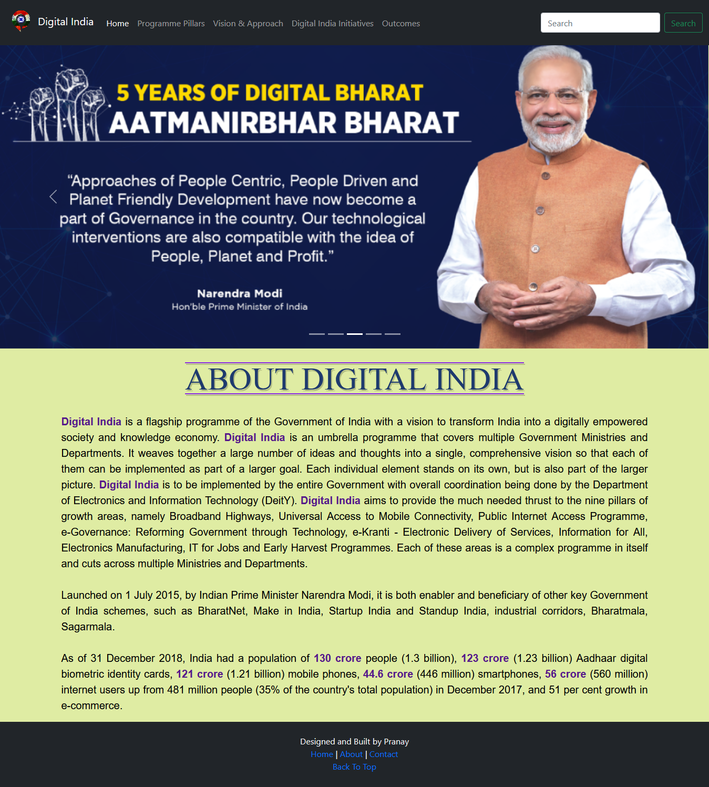
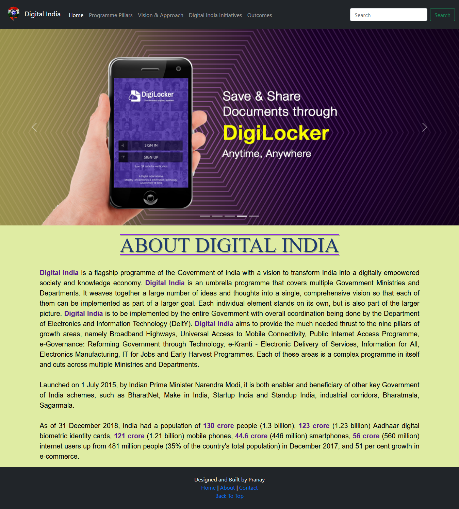
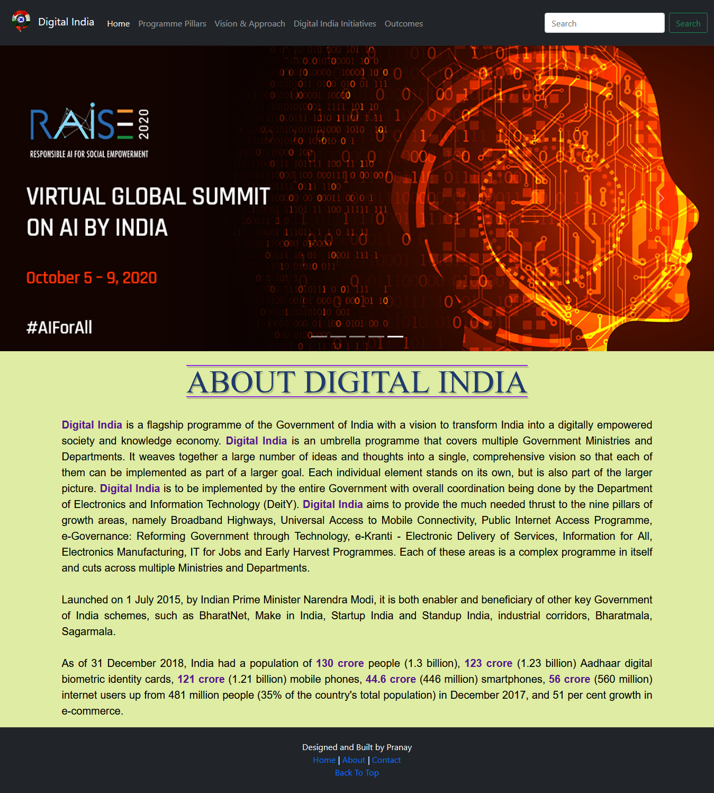
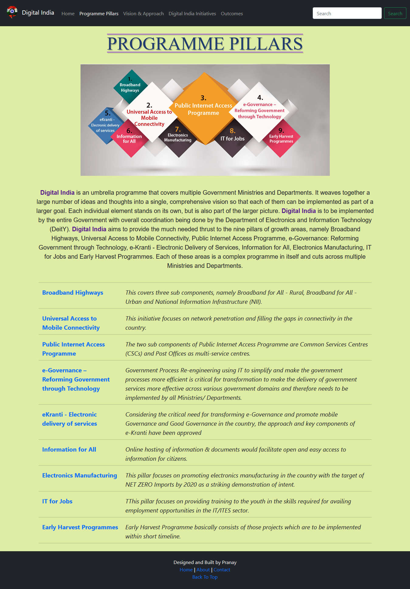
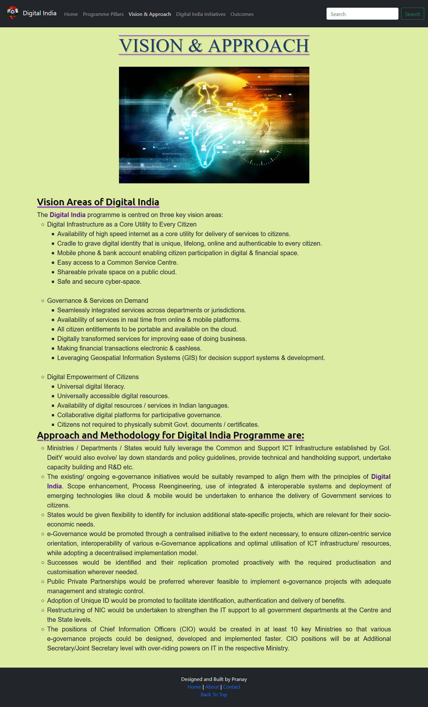
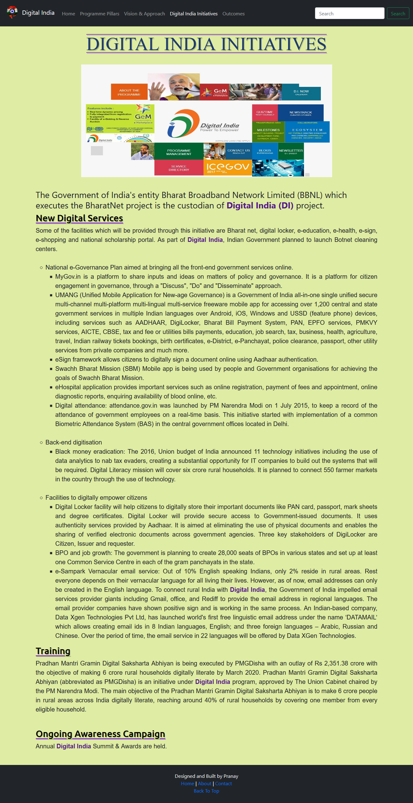
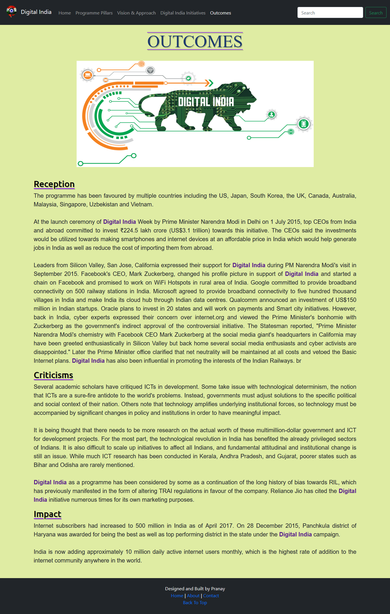

## Mobile-Screenshots
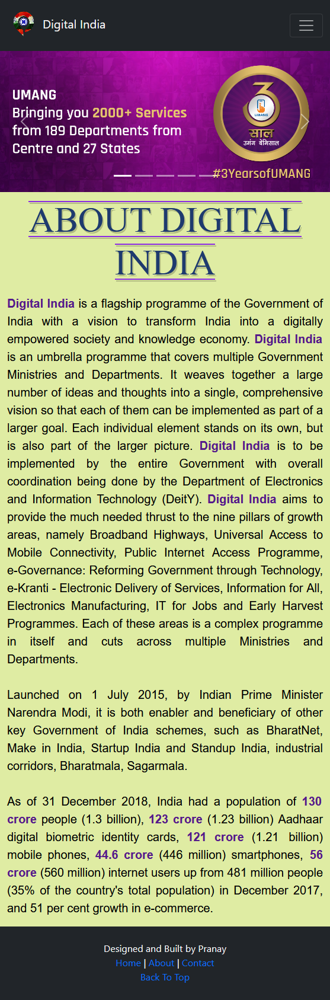
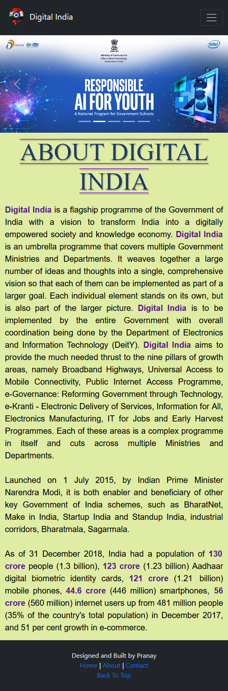
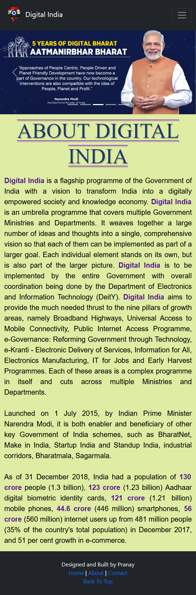
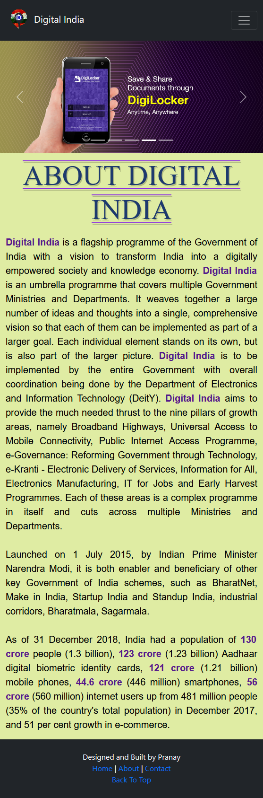
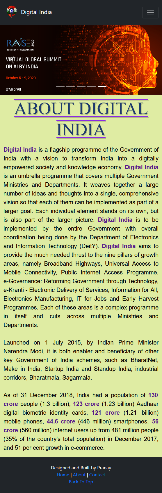
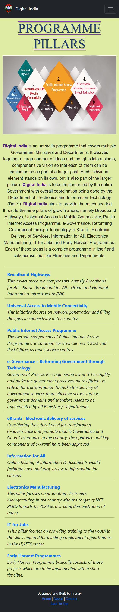
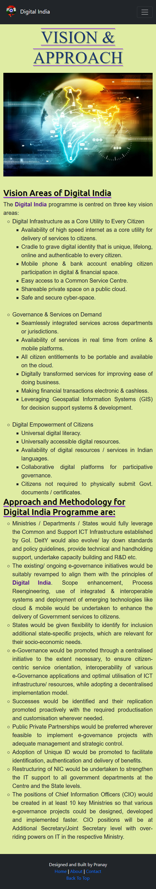
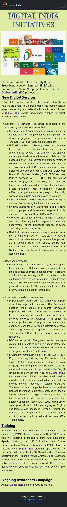
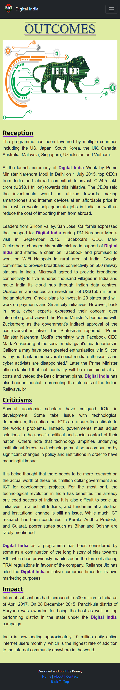

### Thanks
